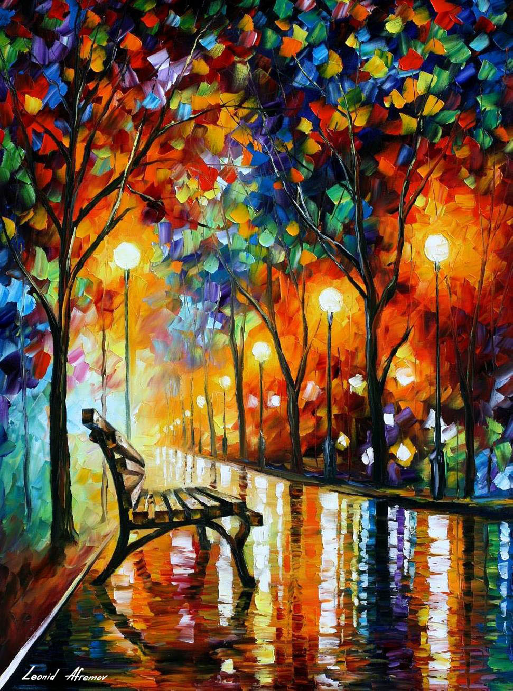
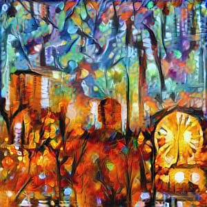

## Synopsis

This project contains two implementations of artistic StyleTransfer, one using Keras and the other CNTK, both for experimentation purposes.
Both implementations ustilized a model based on the VGG16 architecture.

## Sample
(USING CNTK MODEL)
 
Content Image:
 

 
Style Image (All credit to Leonid Afremov):
 

 
Result:
 

